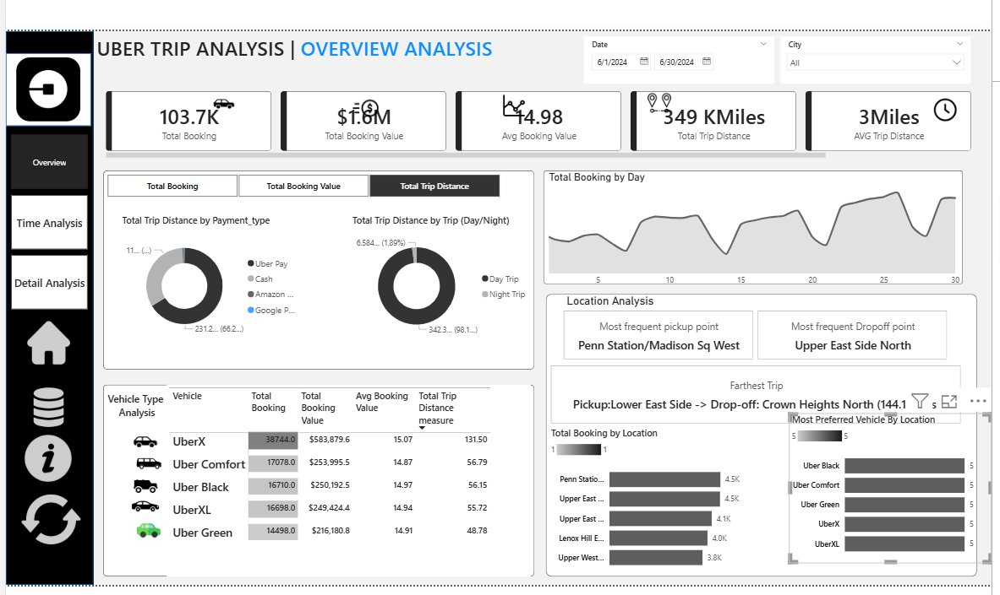
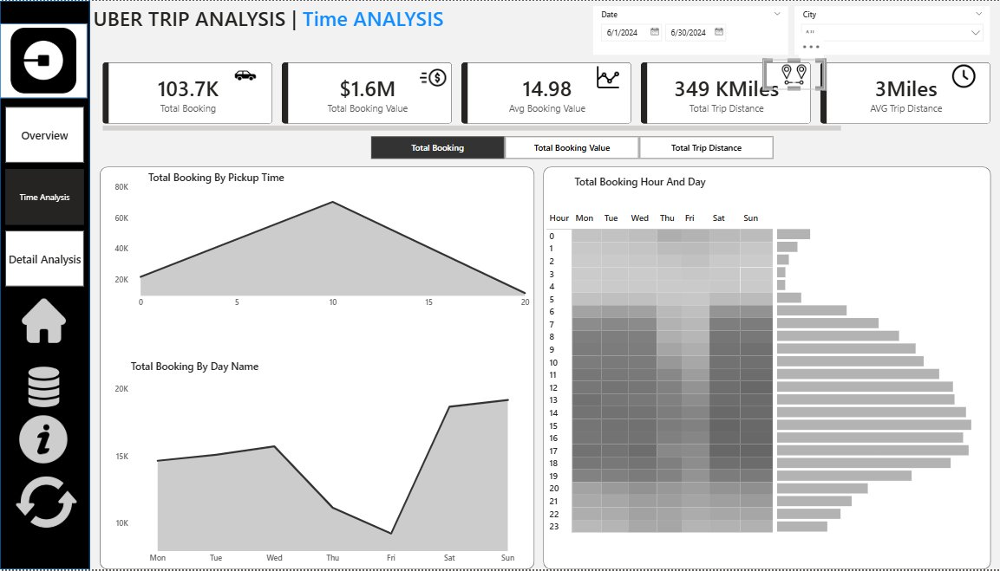
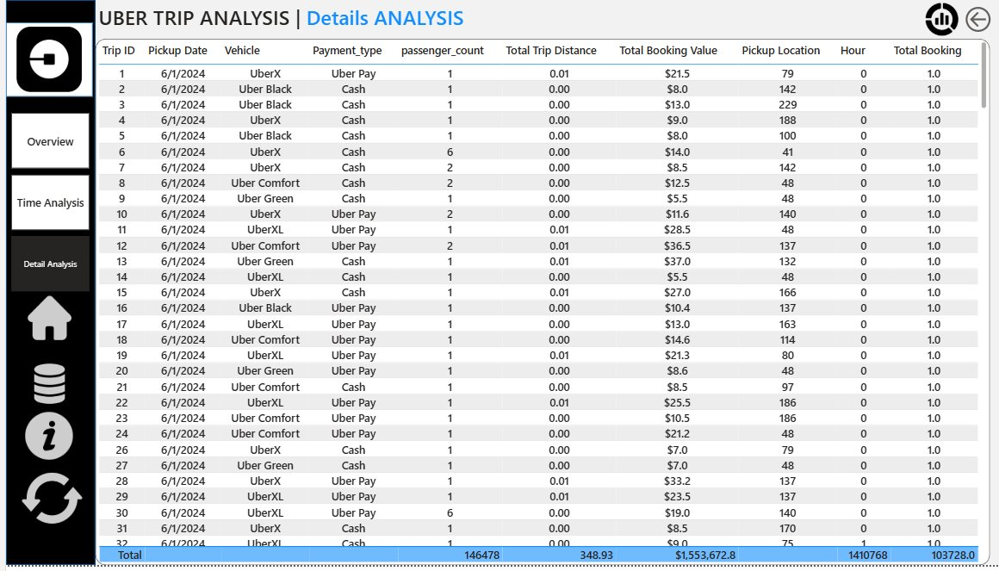

# 🚖 Uber Trip Analysis Dashboard

<p align="center">
  
  
  
  
  
</p>

<p align="center">
  <b>An end-to-end interactive Power BI dashboard analyzing 103,000+ Uber trips — covering bookings, revenue, time patterns, and location intelligence.</b>
</p>

---

## 📸 Dashboard Preview

### Dashboard 1 — Overview Analysis


### Dashboard 2 — Time Analysis


### Dashboard 3 — Details Tab


---

## 📌 Project Overview

This project analyzes real-world Uber trip data from **June 2024** using **Power BI** with advanced DAX measures, dynamic measure selectors, drill-through pages, and heatmap visuals. The goal is to help stakeholders make data-driven decisions on pricing, driver allocation, and demand forecasting.

---

## 📋 Dataset

| File | Description |
|------|-------------|
| `Uber_Trip_Details.xlsx` | 103,728 trip records with fare, distance, vehicle, payment |
| `Location_Table.xlsx` | Location ID to City/Area mapping |

**Key Fields:**
- Trip ID, Pickup Time, Drop-off Time
- Passenger Count, Trip Distance
- Pickup & Drop-off Location IDs
- Fare Amount, Surge Fee
- Vehicle Type *(UberX, UberXL, Uber Black, Uber Comfort, Uber Green)*
- Payment Type *(Uber Pay, Google Pay, Amazon Pay, Cash)*

---

## 📈 Dashboard Pages

### Dashboard 1 — Overview Analysis
> Booking trends, revenue KPIs, vehicle performance, and location hotspots.

**KPIs:**

| Metric | Value |
|--------|-------|
| Total Bookings | 103.7K |
| Total Booking Value | $1.6M |
| Avg Booking Value | $14.98 |
| Total Trip Distance | 349K Miles |
| Avg Trip Distance | 3 Miles |

**Visuals:**
- Dynamic Measure Selector (Total Bookings / Total Booking Value / Total Trip Distance)
- Trip Distance by Payment Type — Donut Chart
- Trip Distance by Day/Night — Donut Chart
- Total Bookings by Day — Line Chart
- Vehicle Type Analysis Grid (UberX, Uber Comfort, Uber Black, UberXL, Uber Green)
- Top 5 Pickup Locations (Penn Station leads at 4.5K)
- Most Frequent Pickup: **Penn Station/Madison Sq West**
- Most Frequent Drop-off: **Upper East Side North**
- Farthest Trip: **Lower East Side → Crown Heights North (144.1 miles)**

---

### Dashboard 2 — Time Analysis
> Identifying peak hours, busiest days, and demand heatmaps.

**Visuals:**
- Total Bookings by Pickup Time — Area Chart (peak around hour 10–12)
- Total Bookings by Day Name — Line Chart (Friday–Saturday highest)
- Hour × Day Heatmap — Matrix Grid (hours 0–23 vs Mon–Sun)

---

### Dashboard 3 — Detail Analysis
> Granular drill-through data table for deep-dive analysis.

**Features:**
- Full trip-level grid (103,728 records)
- Columns: Trip ID, Pickup Date, Vehicle, Payment Type, Passenger Count, Trip Distance, Booking Value, Pickup Location, Hour
- Drill-through from any visual on other pages
- Total row showing: 146,478 passengers | 348.93K miles | $1,553,672.8 revenue

---

## ⚙️ DAX Measures Used

```dax
-- Dynamic Measure Selector
Selected Measure = 
SWITCH(
    SELECTEDVALUE('Measure Selector'[Measure]),
    "Total Bookings", [Total Bookings],
    "Total Booking Value", [Total Booking Value],
    "Total Trip Distance", [Total Trip Distance],
    [Total Bookings]
)

-- Total Booking Value
Total Booking Value = 
    SUM(uber_trip_details[fare_amount]) + SUM(uber_trip_details[Surge Fee])

-- Average Trip Time (Minutes)
Avg Trip Time = 
AVERAGEX(
    uber_trip_details,
    DATEDIFF(uber_trip_details[Pickup Time], uber_trip_details[Drop Off Time], MINUTE)
)

-- Drop-off Location (Inactive Relationship)
Drop-off Location Bookings = 
CALCULATE(
    COUNTROWS(uber_trip_details),
    USERELATIONSHIP(uber_trip_details[DOLocationID], Location_Table[LocationID])
)
```

---

## 🗂️ Data Model

```
Uber_Trip_Details
    ├── PULocationID ──→ Location_Table (LocationID)   [Active]
    └── DOLocationID ──→ Location_Table (LocationID)   [Inactive — activated via USERELATIONSHIP]
```

---

## 🔑 Key Insights

- 📍 **Top pickup location:** Penn Station/Madison Sq West (4.5K trips)
- 🚗 **Most booked vehicle:** UberX with 38,744 bookings ($583K revenue)
- 💳 **Payment split:** Uber Pay dominates, Cash is second
- 🌙 **Day vs Night:** 98.1% Day trips vs 1.89% Night trips
- 📅 **Busiest days:** Friday and Saturday show highest demand
- 🏆 **Farthest trip:** 144.1 miles (Lower East Side → Crown Heights North)

---

## 🚀 How to Use

1. Clone this repository
   ```bash
   git clone https://github.com/Prathmesh-Sanmukh/Uber_Trip_Analysis_Dashboard.git
   ```
2. Open `uber_analysis.pbix` in **Power BI Desktop**
3. Re-link Excel data sources from the repo folder if prompted
4. Explore all 3 dashboard pages using slicers and drill-through

---

## 🛠️ Tools & Technologies

| Tool | Usage |
|------|-------|
| Power BI Desktop | Dashboard creation, DAX, data modeling |
| DAX | KPIs, dynamic measure selector, inactive relationships |
| Power Query | Data transformation & cleaning |
| Excel | Raw data source (103K+ records) |
| Python (Pandas) | Initial data exploration |

---

## 👤 Author

**Prathmesh Sanmukh**
- 🔗 [LinkedIn](https://www.linkedin.com/in/prathmesh-sanmukh)
- 💻 [GitHub](https://github.com/Prathmesh-Sanmukh)

---

*This project is part of my Data Analyst portfolio showcasing Power BI, DAX, and data storytelling skills.*
